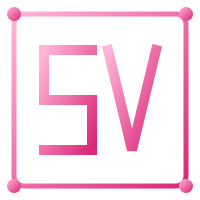

<!-- Tarjeta principal (tu foto va incrustada en assets/hero.svg) -->

  

<!-- Banner con texto dinámico -->

  

<!-- Botones de acceso rápido -->

  
  
  
  

  

---

### 👨‍💻 Sobre Mí

Desarrollador de software en formación en **Campuslands** (Colombia). Transformo ideas y problemas en soluciones de software que pueden generar nuevas posibilidades. Trabajo principalmente con **Java**, **Maven**, **MySQL** y **SQL**, aplicando arquitectura **MVC** y buenas prácticas.

- 🔭 **Construyendo:** mi portafolio profesional web, dinámico y con animaciones.
- 🚚 **Trabajo en equipo:** *RapidExpress*, un sistema CLI de gestión de flotas y rutas en Java + MySQL.
- 🕵️ **Practicando:** consultas SQL resolviendo casos tipo *murder mystery* en SQLite.
- 📐 **Filosofía:** código limpio, capas bien separadas y bases de datos relacionales bien diseñadas.
- 📫 **Contacto:** [velascodazasergio@gmail.com](mailto:velascodazasergio@gmail.com)

---

### 💻 Tech Stack & Skills

  

  

---

### 📈 Actividad & Contribuciones

  

  

---

### 📊 Stats de GitHub

  

---

### 🌟 Proyectos Destacados

| Proyecto | Descripción | Stack |
| :--- | :--- | :--- |
| 🚚 [**RapidExpress-triada**](https://github.com/velascodazasergio-png/RapidExpress-triada) | Sistema CLI de gestión de flotas y rutas (proyecto en equipo). Desarrollé los módulos de flota de vehículos y personal (conductores). | `Java` `Maven` `MVC` `MySQL` |
| 🌸 [**Portafolio Web**](https://portafoliosergy.netlify.app/) | Mi portafolio profesional: página dinámica con animaciones donde muestro proyectos, habilidades y contacto. | `HTML` `CSS` `JavaScript` `Netlify` |
| 🕵️ **The Midnight Murder** | Taller de SQL tipo caso policial: resolver un misterio por fases con consultas sobre la base de datos del caso. | `SQL` `SQLite` `DBeaver` |

---

  <h3>💗 ¡Construyamos algo increíble juntos!</h3>
  
  

 

---

   
  
   
  <b>© Sergio Velasco Daza — SV</b>
    
  <em>Construido con pasión por el código y el detalle.</em> 
  <strong>Sergio Velasco Daza · SV · 2026</strong>

