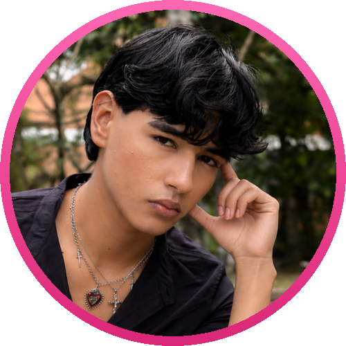

<!-- Banner superior -->

  

<!-- Foto de perfil -->

  

<!-- Banner con texto dinámico -->

  

<!-- Botones de acceso rápido -->

  
  
  
  

  

---

### 🌸 Sobre Mí

Desarrollador de software en formación en **Campuslands** (Colombia). Transformo ideas y problemas en soluciones de software que pueden generar nuevas posibilidades.

- 🔭 **Trabajando en:** mi portafolio profesional web, dinámico y con animaciones.
- 🚚 **Proyecto en equipo:** *RapidExpress*, un sistema CLI de gestión de flotas y rutas en Java + MySQL.
- 🕵️ **Practicando SQL:** resolviendo casos tipo *murder mystery* con consultas en SQLite.
- 📐 **Me enfoco en:** código limpio, arquitectura MVC y bases de datos relacionales bien diseñadas.
- 📫 **Contacto:** [velascodazasergio@gmail.com](mailto:velascodazasergio@gmail.com)

---

### 💻 Tecnologías & Herramientas

  

---

### 📈 Actividad & Contribuciones

  

  

---

### 📊 Stats de GitHub

  
  

---

### 🌟 Proyectos Destacados

| Proyecto | Descripción | Stack |
| :--- | :--- | :--- |
| 🚚 [**RapidExpress-triada**](https://github.com/velascodazasergio-png/RapidExpress-triada) | Sistema CLI de gestión de flotas y rutas (proyecto en equipo). Me encargué de los módulos de flota de vehículos y personal (conductores). | `Java` `Maven` `MVC` `MySQL` |
| 🌸 [**Portafolio Web**](https://portafoliosergy.netlify.app/) | Mi portafolio profesional: página dinámica con animaciones donde muestro proyectos, habilidades y contacto. | `HTML` `CSS` `JavaScript` `Netlify` |
| 🕵️ **The Midnight Murder** | Taller de SQL tipo caso policial: resolver un misterio por fases usando consultas sobre la base de datos del caso. | `SQL` `SQLite` `DBeaver` |

---

  <h3>💗 ¡Construyamos algo increíble juntos!</h3>
  
  
  

 

  

  <b>© Sergio Velasco Daza · 2026</b>

